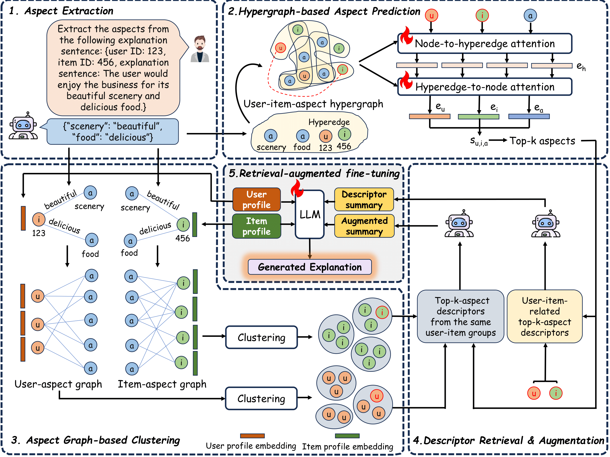

# Hypergraph Reasoning and Clustering-based Aspect Enhancement for Explainable Recommendation


## Environment
Python version 3.11 is recommended to avoid unexpected bugs.

Run the following command to install the dependencies:
```
pip install -r requirements.txt
git clone https://github.com/google-research/bleurt.git
cd bleurt
pip install .
cd ..
```

Add WandB login token (`WANDB_KEY_LOGIN`), HuggingFace login token (`HF_TOKEN`) and OpenAI API key (`OPENAI_API_KEY`) into the `.env` file. (We provided an example in `.env.example`.)

## Dataset
Download the datasets [here](https://drive.google.com/drive/folders/1GlVmCLYYhRFMVnT0un4Ru1puV4D2IixA?usp=sharing), then put it into folder `data` (following the code structure given below).

## Guide for running

Step 1: Extract the aspects from the explanation corpus
```
python extract.py --dataset_name={name of the dataset}
```

Step 2: Predict the aspects for each user-item pair, extract the aspect-related information and summarize
```
python aspect_prediction.py --dataset_name={name of the dataset} --num_epochs={number of epochs} --top_k={number of top aspects} --mode={train, val, test}
```

Step 3: Augment the aspect information with the information of related user-item pairs
```
python aspect_augmentation.py --dataset_name={name of the dataset} --num_cluster={number of clusters} --mode={train, val, test}
```

Step 4: Fine-tune LLM (for training phase)
```
python llm_finetuning.py --dataset_name={name of the dataset} --num_epochs={number of epochs} --batch_size={batch size per device}
```

Step 5: Inference (for evaluation phase)
```
python inference.py --dataset_name={name of the dataset}
```

Step 6: Output evaluation
```
python evaluation.py --dataset_name={name of the dataset} --has_gpt={True or False}
```

## Code structure
```
├── README.md
├── data (amazon/yelp/google)
│   ├── trn.pkl                            # Training data
│   ├── val.pkl                            # Validation data
│   ├── tst.pkl                            # Test data
│   ├── tst_pred.pkl                       # Generated explanation
│   └── tst_ref.pkl                        # Ground-truth explanation
├── model
│   ├── HHGNN.pkl                          # Hypergraph neural network for aspect prediction
│   └── TPC.pkl                            # TPC model for user/item clustering
├── prompt
│   ├── amazon/yelp/google
│   │   ├── aspect_augmentation.txt        # Prompt for aspect augmentation
│   │   ├── aspect_prediction.txt          # Prompt for aspect prediction
│   │   └── extract_aspect.txt             # Prompt for aspect extraction from explanation corpus
│   └── llm_finetune_eval_prompt.json      # Prompt for LLM fine-tuning
└───utils
    ├── dataset.py                         # Dataset class
    ├── metrics.py                         # Metric class
    └── gpt_score_prompt.txt               # Prompt for calculating GPT score
```